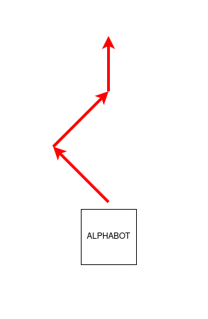
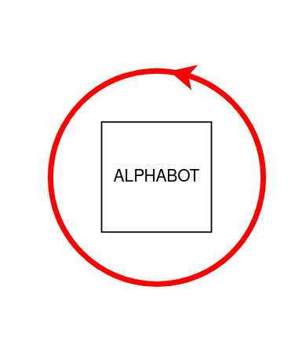
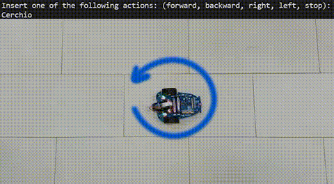
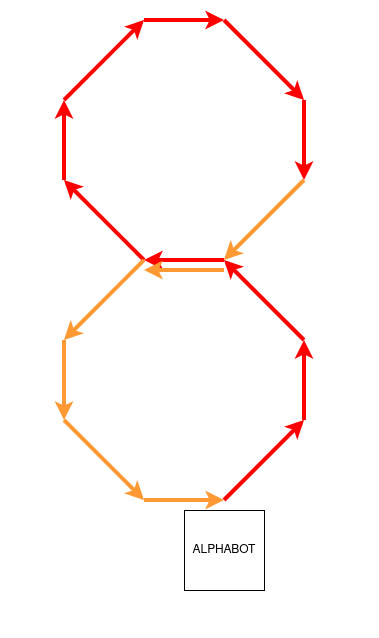
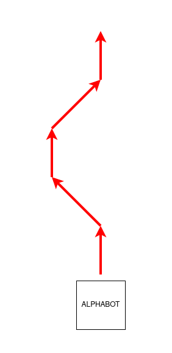

# Project_AlphaBot
Client and server(TCP)  which allows you to control the alphabot robot, thanks also to the use of an sqlite database

## API Reference

### Simple Movements

| Name      | Description                        | Video |
| :-------- | :--------------------------------- | :------------------------- |
| `f:time`  | This command allows the AlphaBot to move **forward** for a certain time (based on the **time** value)          | |
| `b:time`  | This command allows the AlphaBot to move **backwards** for a certain time (based on the **time** value)        | |
| `l:agle`  | This command allows the AlphaBot to rotate to the **left** for a certain angle (based on the **angle** value)  | |
| `r:angle` | This command allows the AlphaBot to rotate to the **right** for a certain angle (based on the **angle** value) | |

### Complex Movements

These movements are stored in a database (**DB_AlphaBot.db**)

| Name        | Description                         | Video|
| :---------- | :---------------------------------- | :-------------------------------- |
| `ZigZag`    |     |  |
| `Cerchio`   |  | |
| `Otto`      |        |  |
| `Slalom`    |    |  |
| `720`       |      |  |

## Authors

- [@Nicholas-Becchis](https://github.com/Nicholas-Becchis)
- [@GabrieleFerrero](https://github.com/GabrieleFerrero)

  
